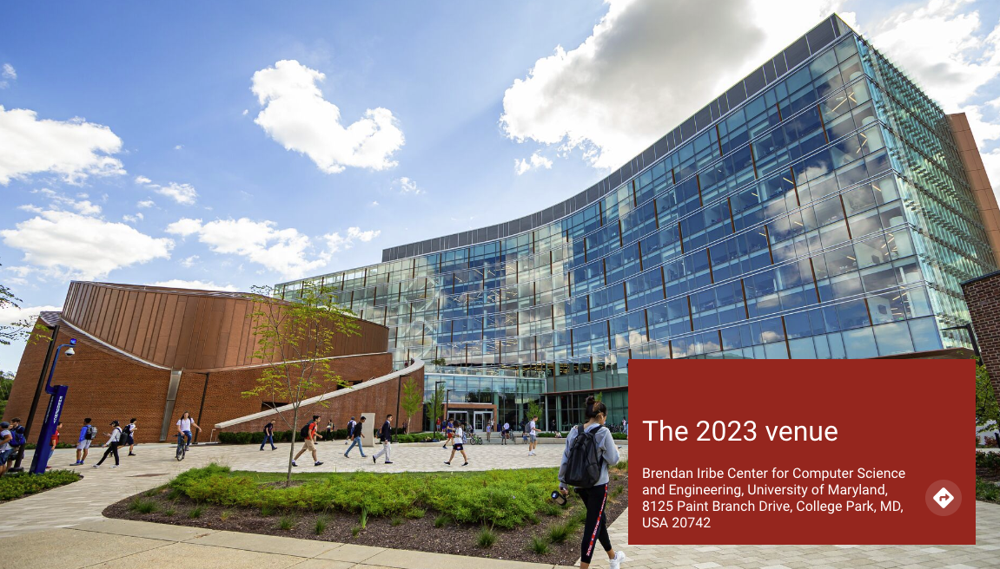
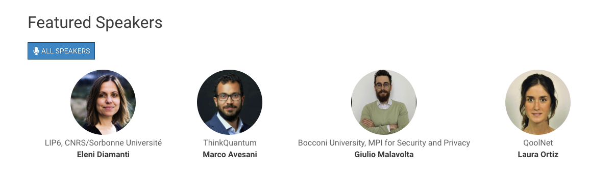
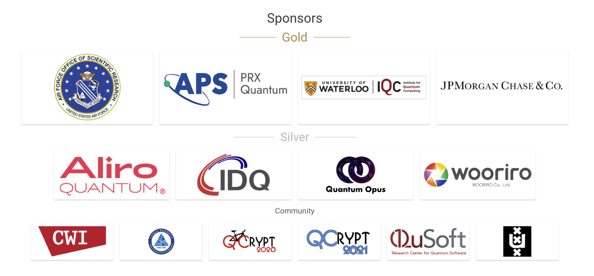

# DevFest Theme Hugo

The theme is located in the `/themes/devfest-theme-hugo/` subdirectory. It originated as an [independent theme](https://github.com/GDGToulouse/devfest-theme-hugo), as a separate git submodule, but since 2023, it's permanently included in the git repository.

> [!NOTE]
> The original multi-lingual support has been dropped, but reminders of it are still lingering around.

## Getting ready to edit the theme

First, install [Node.js](https://nodejs.org/en/download), in particular install `v22.12.0 (LTS)` for `macOS/linux/windows` using `nvm` with `npm`. `nvm` is a cross-platform Node.js version manager. 
> [!WARNING]
> This has only been tested on macOS so far, so sharing your experience with other platforms here is very appreciated!

Make sure you are using the latest `npm` version by
```bash
$ nvm use --lts
Now using node v22.12.0 (npm v10.9.0)
```

Then, in the main `qcrypt-website` folder, run
```bash
$ npm clean-install
```
to install the dependencies as specified in [package.json](/package.json). This will create a `node_modules` subfolder which should not be included in the git repositry (that's why it's excluded in the [.gitignore](/.gitignore)).

This has installed the PostCSS features, so now you should be able to run
```bash
$ hugo build
```
which builds the whole site to the `/public` subfolder, which is also excluded from the git repository. You can always delete this whole folder (`$ rm -rf qcrypt-website/public`) and rebuild it with the command above.

## Theme structure


## Site parameters

Parameters are mostly set in [hugo.toml](../../hugo.toml)

```toml
#...
baseURL = "https://qcrypt.net"
languageCode = "en"
title = "QCrypt Conference Website"

# Theme
theme = "devfest-theme-hugo"

# Params
enableEmoji = true
enableRobotsTXT = true
enableMissingTranslationPlaceholders = true

GoogleAnalytics = "G-XXXXXXXX-X"

[params]
    title = "QCrypt Conference Website"
    date = "2024-09-02"
    currentYear = 2024
    description = "International Conference on Quantum Cryptography"
    images = ["/images/social-share.jpg"]
    email = "webmaster@qcrypt.net"
    keywords = "event, quantum cryptography, QCrypt"
    copyright = "We :heart: sheep"
    copyright_link = "https://github.com/QCrypt/qcrypt-website"
    # cfpUrl = "/2024/call"
    # subscriptionUrl = ""
    appleTouchIcon = "/apple-touch-icon.png"
    favicon32 = "/favicon-32x32.png"
    favicon16 = "/favicon-16x16.png"
    manifest = "/manifest.json"
    safariPinnedTab = "/safari-pinned-tab.svg"

[params.2023]
  city = "Washington DC, USA"
  timeanddate_cityid = 263
  themeColor = "#ac191c"
  [params.2023.logos]
    jumbo = "/images/2023/QuCrC23_Logo.png"
    header = "/images/2023/QuCrC23_Logo.png"
    banner = "/images/2023/banner-2023.jpeg"

[params.2024]
  city = "Vigo, Spain"
  timeanddate_cityid = 4529
  themeColor = "#0099cc"
  [params.2024.logos]
    jumbo = "/images/2024/QCrypt_2024_logo_final.png"
    header = "/images/2024/QCrypt_24_logo_2.png"
    banner = "/images/2024/banner-2024.jpg"

[params.logos]
    footer = "/images/logos/netlify-color-accent.svg"
    footer_link = "https://www.netlify.com"

[server]
  [[server.redirects]]
      from = "/"
      to = "/2024/"
      status = 302
      force = true 

[menu]
  [[menu.2023]]
    name = "Home"
    weight = 10
    identifier = "home"
    pageRef = '/2023'
  [[menu.2023]]
    name = "Technical Program"
    weight = 20
    identifier = "technical-program"
  [[menu.2023]]
    name = "Attend"
    weight = 30
    identifier = "attend"
  [[menu.2023]]
    name = "Sponsors"
    weight = 40
    identifier = "sponsors"
    pageRef = "/2023/partners"
  [[menu.2023]]
    name = "Committees"
    weight = 50
    identifier = "committees"
    pageRef = "/2023/team"

  [[menu.2024]]
    name = "Home"
    weight = 10
    identifier = "home"
    pageRef = '/2024'
  [[menu.2024]]
    name = "Technical Program"
    weight = 20
    identifier = "technical-program"
  [[menu.2024]]
    name = "Attend"
    weight = 30
    identifier = "attend"
  [[menu.2024]]
    name = "Sponsors"
    weight = 40
    identifier = "sponsors"
    pageRef = "/2024/partners"
  [[menu.2024]]
    name = "Committees"
    weight = 50
    identifier = "committees"
    pageRef = "/2024/team"


[languages]
[languages.en]
    weight = 1
    languageName = "us"

#...
```

### Header

The top navigation bar is build with

* Site title
* Site parameter `logos.header` for the logo, specified per year in [hugo.toml](../../hugo.toml)
* Menu `main`

### Footer

The footer is build with

* Site title
* Site params `email`, `subscriptionUrl`, `logos.footer`, `copyright`
* data from `data/footer.yml`

```yml
share:
  - name: facebook
    url: https://www.facebook.com/sharer.php?u=
  - name: twitter
    url: https://twitter.com/intent/tweet?text=

follow:
  - name: twitter
    url: https://twitter.com/Qcryptc
  - name: youtube
    url: https://www.youtube.com/channel/UClpn9CxuZPHw3nzhdv0m3Hw

content:
  - title: footer_about
    links:
      - nameKey: footer_charter
        name: QCrypt Charter
        url: /charter/
        newTab: false
      - nameKey: footer_history
        name: QCrypt History
        url: /history/
        newTab: false
      - nameKey: footer_coc
        name: QCrypt Code of Conduct
        url: /code-of-conduct/
        newTab: false
```

There are also quite some more options in the original tempalate that we are currently not using.

The `url` in the links of `footer_about` is prepended with the `.Params.currentYear`, so that the footer always point to these documents of the current year.


### Home

The Home page is build with markdown and calling some shortcodes like `jumbo`, `button-link`, `home-info` etc..

#### Jumbo bloc

```hugo
{}

## 2-6 September 2024




{}
```


#### Info block

With main description and key figures.

```hugo
{}
## What is QCrypt 2024?

QCrypt 2024 is the 14th edition of the yearly international scientific conference presenting last year's top results in quantum cryptography. See the list of previous conferences <a style="color: yellow" href="/2024/charter/#history-of-qcrypt">here</a>.
{}
```


#### key dates
Define the two important tables with key dates and website updates.

```hugo
{}

{}
|Date |Event|
|:----|:----|
|<strike> 27 March 2023 </strike> | <!-- <a href="https://hotcrp.science.uva.nl/" target="_blank"> --> <strike> Talk submission open now </strike>|
|<strike> Wed, 12 April 2023, 16:00 CET </strike> | <strike> Talk submission deadline </strike>|
|<strike> Wed, 3 May - Tue, 08 August 2023 </strike>| <strike> Registration open now </strike>|
|<strike> Wed, 21 June 2023</strike>|<strike> Talk acceptance notification </strike>|
|<strike>Thu, 22 June 2023</strike>|<strike> Poster submission opens</strike>|
|<strike>Fri, 30 June 2023, 16:00 CET</strike>|<strike>Poster submission deadline</strike>|
|<strike>Sat, 8 July 2023</strike>| <strike>Poster acceptance notification</strike>|
|<strike>Sat, 15 July 2023</strike>| <strike>Early bird rate deadline</strike>|
|<strike>Tue, 08 August 2023</strike>| <strike>Registration deadline</strike>|
|<strong>Mon, 14 - Fri, 18 August 2023 </strong>| <strong>QCrypt 2023</strong>|
{}

{}
|Date |Event|
|:----|:----|
|December 12, 2023 |Talks from QCrypt 2023 are now available to <a href="https://www.youtube.com/playlist?list=PLbY0Lk6JsgBEph5CPYTQZs6cOKBPGSnnI">watch on YouTube.</a>|
|August 17, 2023 | QCrypt 2024 Venue Announced <a href="/2023/2024"> here</a>.|
|August 17, 2023 | <strong>Student Paper Awards Announced</strong> <a href="/2023/sessions/business/">here</a>.|
|August 15, 2023 | The group photo from Monday evening is now <a href="https://umd.box.com/s/ro56fac22mf5j8xkjcb06ggw0igil4nv">available to view and download.</a>|
|August 14, 2023 | The <a href="/2023/sessions/rump/">Rump Session</a> theme is: “We love turtles” ❤️🐢❤️|
|August 14, 2023 | Attendees are encouraged to fill out the <a target="_blank" href="https://docs.google.com/forms/d/e/1FAIpQLScFytHnfnz8iix5UXr8YUJgxAiBvdEAtshy3y9twJvQAY8DBA/viewform">exit questionnaire</a> about their conference experience.|
|August 11, 2023 | The digital version of the <a href="https://umd.box.com/s/0gp344b5j4wupyrv9wbivjdpfw350rvx">conference program is now available.|
|August 4, 2023 | Updated Rump Session Instructions: Have a breakthrough result or an amusing quantum cryptography anecdote? Share it at the QCrypt 2023 Rump Session! Submit your proposal <a href="/2023/sessions/rump/"><strong>here</strong></a> before the early submission deadline on Tuesday, August 15, at 11:30 a.m. to secure your spot.|
{}

{}
```

If there is enough space, the tables are displayed next to each other.

#### Location block

Show conference location.

```hugo
{}

## The 2023 venue

### Centre de Congrès Pierre Baudis

The Centre de Congrès Pierre Baudis is a modern place of exchange,
located on a privileged location,
in the immediate vicinity of the centre of Toulouse and in a green environment.

{}
```




#### Feature speakers block 

Just present your feature speakers

```hugo
{}
## Featured Speakers

{}
```



### Partners block

Show your partners

```hugo
{}
## Sponsors
{}
```




### Blocks currently not used
We are currently not using these blocks, but they could be reactived when needed.


#### Subscription block (not used)

Call to subscribe

Use the site param `subscriptionUrl`.

```hugo
{}

## Get notified about the important conference updates

{}
```


#### Ticket block (not used)

Display ticket information.

```hugo
{}
# Tickets

<ul>  
<li></li>
<li></li>
<li></li>
</ul>

\* Your ticket gives you access to all conferences, coffee breaks, and lunch. Accommodation is NOT included in this price.

{}
```


#### Album block (not used)

```hugo
{}

### Some pictures of the **DevFest Toulouse 2018** with the 👾 _retro-gaming_ theme.

<a class="btn primary" target="_blank" rel="noopener" href="https://photos.app.goo.gl/nJYFVReFUk9mnXbv9">
    See all photos
    {}
</a>

{}
```


### Partners

A partner should have these parameters:

```yaml
---
title: QuSoft
type: partner
year: 2023
draft: false
category: community
logo: /2023/partners/logos/qusoft.jpg
website: http://www.qusoft.org
socials: []
---
```

### Speakers

A speaker should have these parameters:

```yaml
key: diamanti
name: Eleni Diamanti
surname: Diamanti
year: 2024
company: LIP6, CNRS/Sorbonne Université
photoURL: /2024/speakers/images/diamanti.jpg
type: invited
website: '/2024/sessions/invited_diamanti'
---
```

`surname` is used for sorting speakers.

> [!WARNING]
> The bio of the speaker should be put into the description of the session, like on [this example](https://qcrypt.net/2023/sessions/invited_kalai/). There are **no individual speaker pages!**


additional parameters we are not using:
```yaml
id: jane_doe
featured: false
photo: /images/speakers/jane_doe.jpg
socials:
  - icon: twitter
    link: 'https://twitter.com/jane_doe'
    name: '@jane_doe'
  - icon: github
    link: 'https://github.com/jane_doe'
    name: jane_doe
shortBio: "Short bio"
companyLogo: /images/speakers/company/company.jpg
country: 'City, Country'
```
The body of the file is used as long bio.


### Sessions
A session should have these parameters:

```yaml
---
title: "Invited Talk: Constructive Post-Quantum Reductions"
speakers:
  - kalai
draft: false
format: invited
type: sessions
year: 2023
videoID : 8VNh1dyQxsg
presentation: "/2023/sessions/slides/QCrypt2023InvitedKalai.pdf"
---
## Bio
**Yael Tauman Kalai** is a Senior Principal Researcher at Microsoft Research and Adjunct Professor at the Massachusetts Institute of Technology (MIT). Kalai earned a B.Sc in Mathematics from the Hebrew University of Jerusalem, an MS in Computer Science and Applied Mathematics from The Weizmann Institute of Science, and a Ph.D. in Computer Science from MIT.

## Abstract
In this talk I will discuss when we can "lift" classical reductions to post-quantum ones in a constructive manner...
```


not used are
```yaml
id: an_id
language: Français
complexity: Beginner
tags:
  - Category
speakers:
  - speaker id
talkType: Keynote
```
The body of the file is used as description.

### Team

A team member should have these params:
```yaml
---
title: Gorjan Alagic
surname: Alagic
type: core
year: 2023
subtitle: University of Maryland & NIST
job: General chair
photoURL: /2023/team/images/gorjan_alagic.jpg
socials:
  - link: 'https://quics.umd.edu/people/gorjan-alagic'
    name: Site
---
```

### Schedule
Schedule data per year is in `/data/schedule-YEAR.yml`, for example:

```yml
- day: '2024-09-02'
  sessions:
    - session: __checkin
      time: '08:30'
    - session: __welcomingremarks
      time: '09:00'
    - session: tutorial_tavakoli
      time: '09:15'
    - session: invited_lo
      time: '10:30'
    - session: __break
      time: '11:15'
    - session: invited_malavolta
      time: '11:45'
    - session: contributed1a
      time: '12:30'
    - session: __lunch
      time: '13:10'
    - session: contributed1b
      time: '14:40'
    - session: __break
      time: '16:00'
    - session: contributed1c
      time: '16:30'
    - session: __reception
      time: '19:00'

- day: '2024-09-03'
  sessions:
    - session: __updates&announcements
      time: '09:00'
    - session: tutorial_lukens
      time: '09:15'
    - session: invited_cao
      time: '10:30'
    - session: __break
      time: '11:15'
    - session: invited_brunner
      time: '11:45'
    - session: contributed2a
      time: '12:30'
    - session: __lunch
      time: '13:10'
    - session: contributed2b
      time: '14:40'
    - session: __break
      time: '16:00'
    - session: contributed2c
      time: '16:30'
    - session: poster
      time: '17:10'
    - session: _public_lecture
      time: '19:00'
    - session: __endofday
      time: '20:00'
```

The `session` field refers to the `.md` content file in `/YEAR/sessions/`.
The `time` field is the start time of the day.

> [!NOTE]
> When displaying a single session like [this one](https://qcrypt.net/2023/sessions/tutorial_yuen/), the start and end time are inferred from the schedule. In particular, the **end time** is the start time of the next event. Therefore, it's wise to include a `__endofday` event in the schedule of every day.


### Charter, History, Code of Conduct, other pages
just classic markdown files. 


### Blog (not used)
A blog should have these params:

```yaml
title: Title
brief: Short brief
image: /images/blog/photo.jpeg
date: 2019-01-20
draft: false
```

And of course, the body is the blog post.

## Debugging and Developing
Editing the theme can be tricky at times. 

### Which template?
Hugo's [template lookup order](https://gohugo.io/templates/lookup-order/) is not straightforward, so often it's not fully clear which template is actually used to display the current page. Therefore, when the local `hugo server` is run, some additional debug information is displayed on the page, often clarifying which template is used, and some additional information about the context.

This information is not displayed in a production environment, so don't worry about it.

```hugo
{{ if hugo.IsProduction | not }}
  <div style="background: #f0f0f0; padding: 10px; margin: 10px; font-family: monospace; font-size: 12px;">
    <details>
      <summary>Debug Info from baseof.html </summary>
      <pre>
  Page Kind: {{ .Kind }}
  RelPermalink: {{ .RelPermalink }}
  Anchorized RelPermalink: {{ anchorize .RelPermalink }}
  Section: {{ .Section }}
  Section Type: {{ printf "%T" .Section }}
  Section Type: {{ len .Section }}
  Section empty? {{ eq .Section "" }}
  Type: {{ .Type }}
  Layout: {{ .Layout }}
  Current Section: {{ .CurrentSection }}
  Parent Section: {{ .CurrentSection.Parent }}
  Params.currentYear: {{ .Site.Params.currentYear }}
  Current Year: {{ $currentYear }}
      </pre>
    </details>
  </div>
{{ end }}
```


## License
MIT, see [LICENSE](https://github.com/jweslley/hugo-conference/blob/master/LICENSE).
